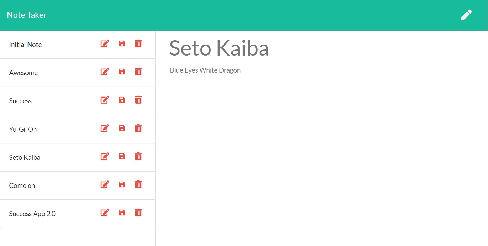

# noteTaker

Summary

The web application is a noteTaker application that enables the user to create a list of saved
notes each with a title and text. Once the notes list has been generated, the user has the
options to:
- Create and save a new note
- Delete an unwanted note
The application uses a server to retrieve and send data across various files which are then used
the process the data in order to display the created notes to the user. On the user interface side
there are a few additional features added to the application including:
- Creating an empty array if there is no data in the save file
- Editing an existing note
- Not duplicating an existing note title

The following npm's and methods where used in the development of this application:
- fs
- express
- path
- jquery
- util
- .gitignore
- get
- post
- delete
- ajax

Getting Started

This documentation will assist you in viewing this project. To view the project either open
the url of the deployed application with the following address in any browser:

https://lit-cliffs-40463.herokuapp.com/

Download and clone the repository from GitHub using the following command:

git clone https://github.com/pozengineer/noteTaker.git

This application was built using:
- HTML: HyperText Markup Language that allows the developer to describe pages
- CSS: Style Sheet Language that allows the developer to style an HTML document
- BootStrap: Library of HTML and CSS files and code https://getbootstrap.com/
- API: Application Programming Interface, which is a software intermediary that
  allows two applications to talk to each other.
- Node.js: An open-source, cross-platform, JavaScript runtime environment that
  executes JavaScript code outside of a browser.
- Express.js: An open source web application framework for Node.js
- Heroku: Is a platform as a service (PaaS) that enables developers to build, run,
  and operate applications in the cloud

